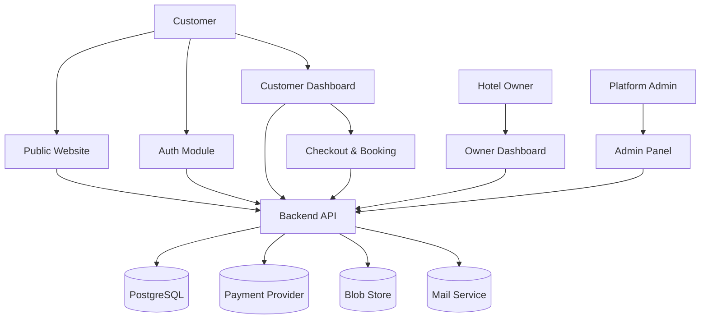

# Project overview — Horizoné

Horizoné is a hotel booking platform. The frontend is a single-page
application (SPA) that lets customers browse and book hotels, hotel owners
manage their properties, and platform admins run the whole marketplace.

This document gives you the high-level picture: what the project is, who it
serves, how it is built, and where it is going.

## Project name

Horizoné (the codebase folder is `traveling-app`).

## Short description

A premium hotel booking marketplace that connects three groups of users:

- **Customers** search, compare, and book hotel rooms.
- **Hotel owners** list properties, manage rooms and pricing, and handle
  guest bookings.
- **Platform admins** approve hotels, moderate reviews, and manage the
  marketplace.

## Main purpose

Give travelers a clean, editorial way to discover and book luxury stays
across the world, while giving hotel owners a full dashboard to run their
business, and giving the platform team tools to keep the marketplace safe
and profitable.

## Target users

| Role | What they want |
|---|---|
| Guest (not signed in) | Browse hotels, destinations, and offers without an account |
| Customer | Book rooms, save favorites, track trips, leave reviews, pay |
| Hotel owner | List hotels, set prices, manage availability, receive payouts |
| Platform admin | Approve listings, moderate content, manage users, view analytics |

## Core modules

The frontend is split into six functional areas, each with its own pages,
layouts, and navigation:

1. **Public** — homepage, hotel search, hotel detail, room detail,
   destinations, offers, help center, legal pages.
2. **Auth** — login, register, email verify, forgot/reset password, user
   onboarding, owner onboarding.
3. **Customer account** — profile, bookings, wishlist, reviews, payments,
   settings, notifications.
4. **Booking** — checkout flow plus success, failed, and cancelled result
   pages.
5. **Owner dashboard** — dashboard, analytics, calendar, hotels, rooms,
   bookings, reviews, payouts, notifications, settings.
6. **Admin panel** — dashboard, users, owners, hotels, bookings, reviews,
   offers, destinations, settings.

## Tech stack

The frontend is built with the following tools:

- **Vite** — dev server and build tool (version 8.x).
- **React** — UI library (version 19.x).
- **TypeScript** — typed JavaScript across the whole project.
- **React Router** — client-side routing (`react-router` v8).
- **Tailwind CSS** — styling, version 4, wired through
  `@tailwindcss/vite`.
- **shadcn/ui** — the component library (`base-vega` style, `neutral` base
  color), installed into `components/ui/`.
- **lucide-react** — icon set.
- **Recharts** — charts for the owner and admin dashboards.
- **date-fns** — date formatting.
- **sonner** — toast notifications.

There is no backend yet. All data comes from static mock files in
`src/data/`.

## Current frontend state

The frontend is a complete, navigable UI prototype. Every page renders,
all routes work, and the dashboards show realistic mock data. Key facts:

- 78 page files cover every area listed above.
- 57 shadcn/ui primitives sit in `components/ui/`.
- Around 55 custom components live in `components/custom/`.
- The router maps about 90 routes (see `04-route-map.md`).
- Mock data is split into 23 files across `src/data/` and the
  `owner/` and `admin/` subfolders.

## Current limitations

The prototype is UI-only. It does not yet do the following:

- **No authentication.** The `src/context/` folder is empty. There is no
  login session, no protected routes, and no role checks. Anyone can open
  `/owner/*` or `/admin/*` by typing the URL.
- **No backend, no API calls.** Every page imports data directly from
  `src/data/*`. There is no fetch layer, no loading state tied to a real
  server, and no mutation handling.
- **No global state.** There is no Context, Redux, or Zustand. Search
  filters, the checkout, and the wishlist are all local to each page.
- **No 404 route.** Unknown URLs render a blank page.
- **No real payments or file uploads.** Checkout and owner image galleries
  are static mockups.
- **Inconsistent IDs.** Public hotel detail pages look up by slug, while
  owner and admin pages look up by id. The route params use the name
  `:hotelId` for both, which is misleading.

## Future backend integration expectations

The backend will be built later. The docs in this folder describe what the
backend must do so the frontend can move from mock data to real APIs.

The agreed backend stack is:

- **Node.js + Express** for the HTTP server.
- **Prisma** as the ORM.
- **PostgreSQL** as the database.
- **JWT** access and refresh tokens for auth (both stored client-side).

Third-party services stay as abstract slots for now:

- A **payment provider** handles card, wallet, and refund flows.
- A **blob store** handles hotel and room image uploads.
- A **mail service** sends verification, reset, and notification emails.

You will find the full contract in `10-api-contracts.md`, the data models
and Prisma schemas in `09-data-models.md`, and the integration plan in
`20-backend-integration-plan.md`.

## High-level architecture

The diagram below shows how users reach the backend through the frontend
modules.

## Next steps

Read `01-requirements.md` for the full functional and non-functional
requirements, then `04-route-map.md` to see every route the app has today.