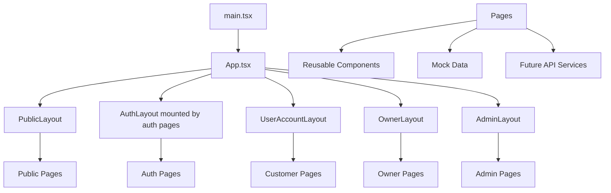

# Frontend architecture

This document explains how the Horizoné frontend is wired together, from
the entry point down to the data layer. It also defines the target
architecture for backend integration.

## App entry flow

1. `index.html` loads `src/main.tsx`.
2. `main.tsx` wraps the app in `<StrictMode>` and `<BrowserRouter>`, then
   renders `<App />`.
3. `App.tsx` declares every `<Route>` and maps pages to layouts.

There is no top-level provider for auth, theme, or queries today. The only
global wrapper is `BrowserRouter`.

## Router flow

The router uses nested routes. Layout routes have no `path` and render an
`<Outlet />`:

- `PublicLayout` wraps the public pages (except `/`, which renders its own
  chrome).
- `UserAccountLayout` wraps the customer pages.
- `OwnerLayout` wraps the owner pages.
- `AdminLayout` wraps the admin pages.
- Auth and booking pages are standalone and mount their own layout
  component internally.

The full route list is in `04-route-map.md`.

## Layout hierarchy

## Page composition

A typical page does the following:

1. Reads route params with `useParams`.
2. Imports mock data directly from `src/data/*`.
3. Finds the record by slug or id.
4. If the record is missing, renders an inline `NotFoundState`.
5. Otherwise renders sections built from reusable components.

Dashboards follow the same pattern but use `OwnerStatCard` and
`AdminStatCard`, charts, and `OwnerDataTable`/`AdminDataTable` with skeleton
and empty states.

## Component layers

The component tree has three layers:

- **shadcn/ui primitives** in `components/ui/` (57 files). These are the
  base building blocks (button, card, table, dialog, and so on).
- **Custom feature components** in `components/custom/`, grouped by area:
  `shared`, `landing`, `auth`, `booking`, `user`, `owner`, `admin`.
- **Pages** in `src/pages/`, which compose custom components and primitives.

See `08-component-architecture.md` for the full component inventory.

## Data layer

Today the data layer is a set of static TypeScript modules in `src/data/`.
Pages import arrays directly:

- `hotels`, `rooms`, `destinations`, `offers`, `publicOffers`,
  `propertyTypes`, `reviews`, `myReviews`, `bookings`, `payments`,
  `notifications`, `wishlist`, `helpArticles`, and `currentUser`.
- `owner/` subfolder: `ownerUser`, `ownerHotels`, `ownerRooms`,
  `ownerBookings`, `ownerReviews`, `ownerPayouts`, `ownerNotifications`,
  `owner-analytics`, `owner-calendar`, `owner-amenities`,
  `owner-policies`.
- `admin/` subfolder: `adminSummary`, `adminActivity`,
  `adminUsers`, `adminOwners`, `adminHotels`, `adminBookings`,
  `adminReviews`, `adminOffers`, `adminDestinations`, plus the analytics
  metric arrays.

There is no repository or fetch abstraction. This is the main thing the
backend integration phase must add.

## Mock data layer

Because everything is static, the following are true today:

- No loading skeletons are tied to real fetches (the components exist but
  are drawn statically).
- No error handling for failed requests.
- No mutations; all forms are visual only.
- IDs are split: public pages use slugs, while owner and admin pages use
  ids.

## Future API service layer

The target adds a service layer that pages call instead of importing data
directly. The structure is in `20-backend-integration-plan.md`. In short:

- `src/services/api-client.ts` configures a fetch or axios instance with a
  base URL and an auth token interceptor.
- Domain services (`hotels.service.ts`, `bookings.service.ts`, and so on)
  wrap each endpoint.
- Pages use TanStack Query hooks to fetch and mutate through the services.

## State management approach

Today there is no global state. State lives in three places:

- **Local component state** for forms, modals, and toggles.
- **Inline lookups** for route data (no shared cache).
- **Component-local search and filter state** on the hotels page.

### Recommended future state management

| State type | Where it should live |
|---|---|
| Auth session and user role | A small Zustand store or Context (the only true global state) |
| Server data (hotels, bookings, reviews) | TanStack Query (server cache, refetch, invalidation) |
| Search, filters, pagination, sort | URL search params (shareable and refresh-safe) |
| Checkout selection (room, dates, guests) | A lightweight checkout store or URL params |
| Form state | Local component state with Zod validation |
| Toasts and modals | Local state (sonner handles toasts) |

Keep global state small. Most state should be either server state or URL
state.

## Error handling approach

Today, detail pages show an inline `NotFoundState` when a record is
missing. Dashboards show an `EmptyState`. There is no global error
boundary.

### Recommended future error handling

- Add a top-level React error boundary that catches render errors and
  shows a friendly fallback.
- The API client maps HTTP statuses to a typed `ApiError` and shows a toast
  for mutations.
- TanStack Query's `isError` drives inline error banners for queries.

## Form handling approach

Today, forms are uncontrolled or use plain local state. There is no form
library.

### Recommended future form handling

- Use `react-hook-form` for complex forms (checkout, hotel edit, offer
  create).
- Validate with Zod schemas shared between frontend and backend.
- Wire submit handlers to TanStack Query mutations.

## Next steps

See `07-folder-structure.md` for the file layout that supports this
architecture.