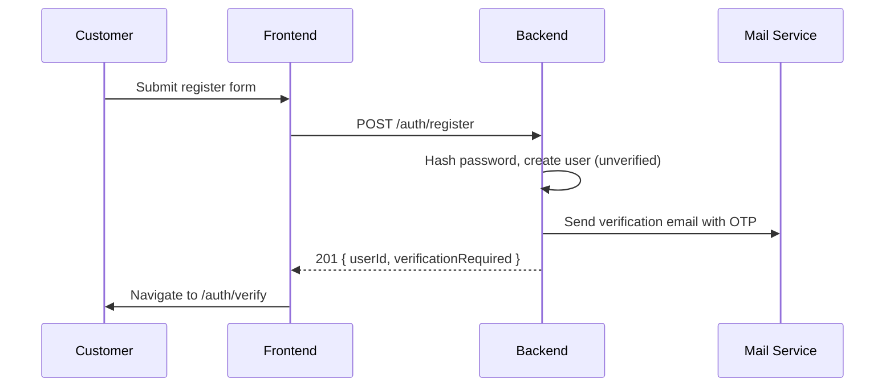
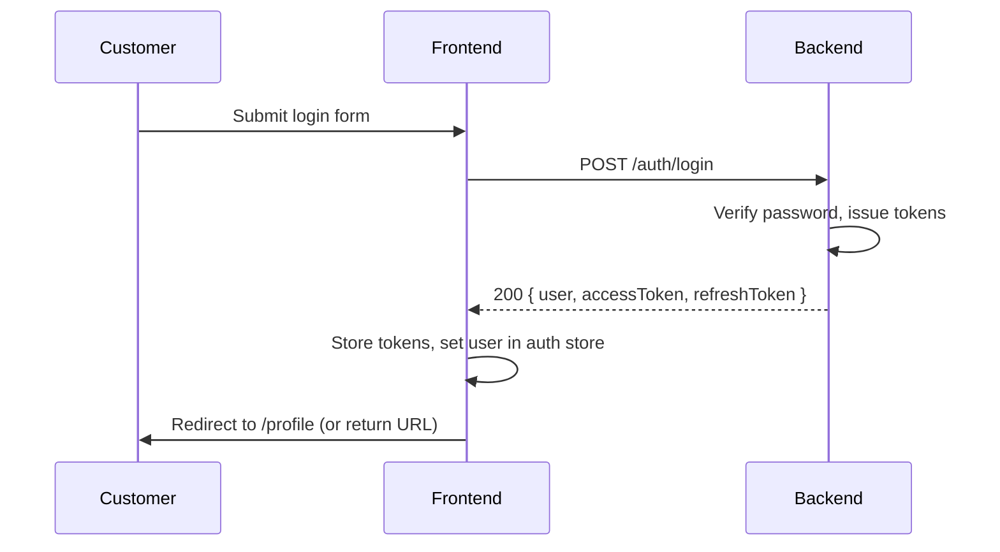
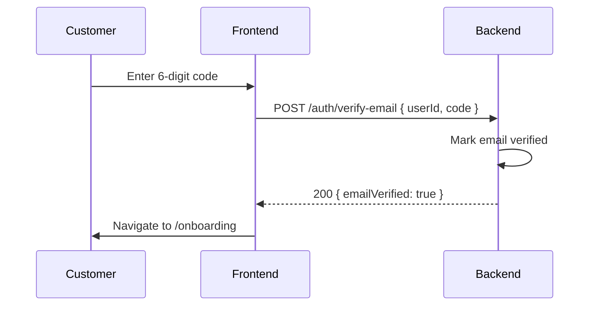
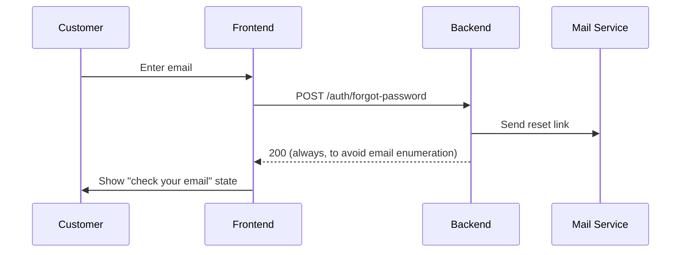
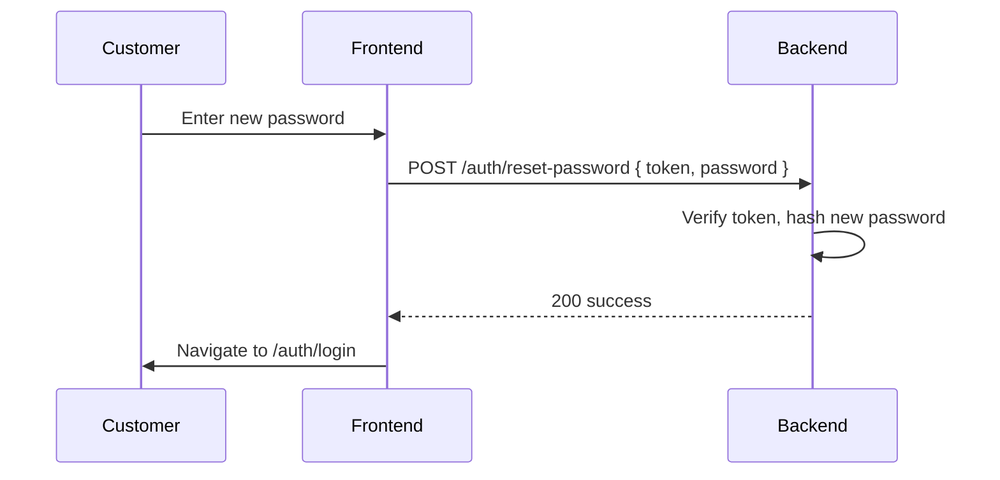
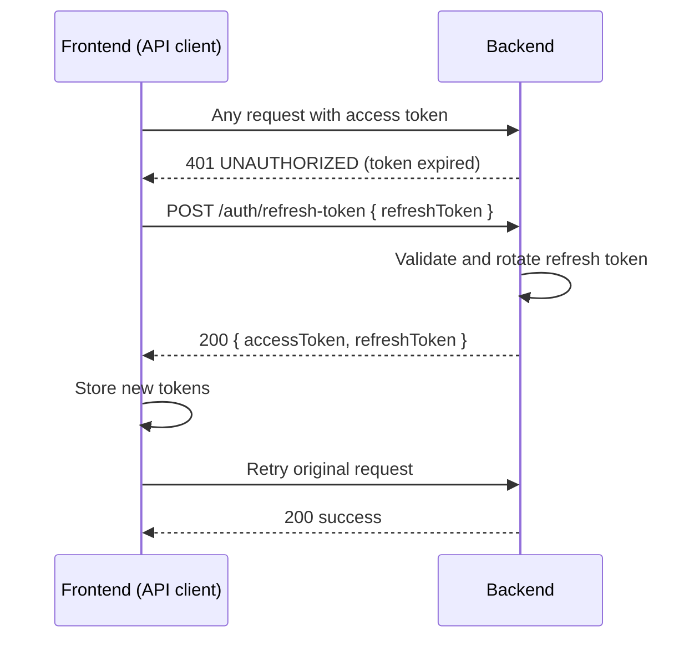
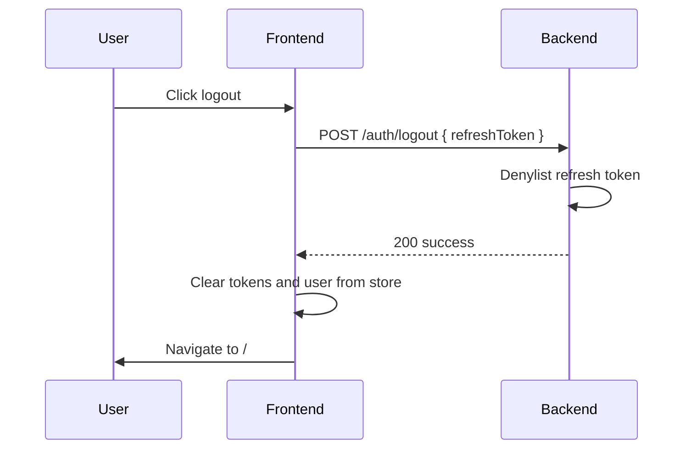

# Authentication flow

This document describes how a user registers, logs in, verifies their
email, recovers a password, onboards, and logs out. It defines the token
strategy and how the frontend protects routes.

## Token strategy

Horizoné uses JWT access and refresh tokens, both stored client-side.

- **Access token:** Short-lived (15 minutes). Sent in the
  `Authorization: Bearer <token>` header on every request.
- **Refresh token:** Long-lived (30 days). Used only to get a new access
  token. Rotates on every refresh. If an old refresh token is reused, all
  tokens for that user are revoked (reuse detection).
- **Storage:** Both tokens live in memory or `localStorage` on the client.
  The auth store (a small Zustand store or Context) holds them and the
  current user.

This is less secure against XSS than httpOnly cookies, but it matches the
chosen SPA flow and migrates cleanly from the current mock state.

## Register flow

After register, the user is not logged in. They must verify their email.

## Login flow

Unverified users can log in but see a banner prompting verification.

## Email verification flow

If the code is wrong or expired, the frontend shows an error and lets the
user resend the code.

## Forgot password flow

The reset email contains a token that expires in one hour.

## Reset password flow

## User onboarding flow

After email verification, a customer lands on `/onboarding`. The
`OnboardingStepper` walks through:

1. Profile basics (nationality, language).
2. Interests (beach, city, spa, and so on).
3. Preferred destinations.
4. Notification preferences.

On finish, the frontend calls `POST /auth/onboarding`, then redirects to
`/profile`.

## Owner onboarding flow

A customer who wants to become an owner visits `/onboarding/owner`. The
steps collect:

1. Business name and type.
2. Registration number and country.
3. Address.
4. Verification documents (uploaded via `POST /uploads`).

On finish, the frontend calls `POST /auth/owner-onboarding`. The backend
upgrades the user role to `owner` with `verificationStatus: pending` until
the platform team reviews the application.

## Protected route strategy

The frontend adds a `ProtectedRoute` wrapper around each protected layout
route. It has three checks:

1. **Authed check:** If no access token, redirect to `/auth/login` with a
   `redirect` query param.
2. **Role check:** If the token role does not match the route group
   (`customer`, `owner`, or `admin`), redirect to `/403` or the user's
   home.
3. **Email check:** If the user is unverified and the route is not an auth
   route, redirect to `/auth/verify`.

The owner layout wraps `/owner/*`. The admin layout wraps `/admin/*`. The
customer layout wraps `/profile/*` and `/booking/*`.

## Role-based redirects

After login, where the user lands depends on their role:

- `customer` -> `/profile` (or the `redirect` query param).
- `owner` -> `/owner/dashboard`.
- `admin` -> `/admin/dashboard`.

If a customer tries to open `/owner/*`, they are redirected to `/profile`
with an access-denied toast. Same for owners and `/admin/*`.

## Token refresh flow

If the refresh call also fails (refresh token expired or revoked), the API
client clears the auth store and redirects to `/auth/login`.

## Logout flow

The client must also discard the access token, since the server cannot
revoke it before it expires.

## Next steps

See `12-booking-flow.md` for the booking lifecycle.