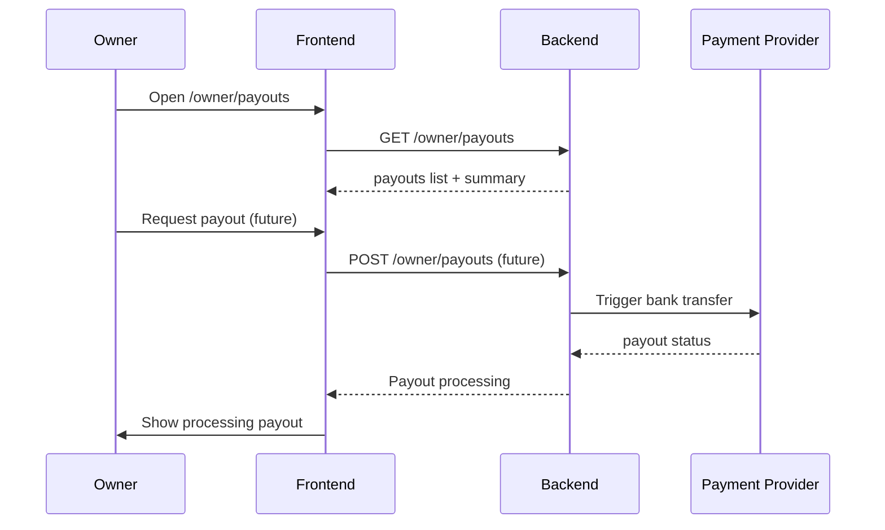

# Owner dashboard flow

This document follows a hotel owner from onboarding to payouts and
notifications. It maps each step to the real owner pages and the backend
endpoints behind them.

## Onboarding

A customer becomes an owner at `/onboarding/owner`. The steps collect
business name, type, registration number, country, address, and
verification documents. On finish, the frontend calls
`POST /auth/owner-onboarding`, which upgrades the user to role `owner`
with `verificationStatus: pending`.

Until the platform team verifies the owner, they can enter the owner
dashboard but cannot publish hotels.

## Add hotel

The owner creates a hotel at `/owner/hotels/new` via `POST /owner/hotels`.
A new hotel starts with:

- `approvalStatus: pending`
- `listingStatus: inactive`
- `status: draft`

The hotel is invisible on the public site until an admin approves it.

## Hotel approval dependency

This is the key dependency in the platform:

1. The owner finishes and submits the hotel for review.
2. The hotel appears in the admin pending queue
   (`/admin/hotels/pending`).
3. An admin reviews it and calls `POST /admin/hotels/:hotelId/approve` or
   `reject`.
4. On approval, the hotel becomes `approvalStatus: approved` and
   `listingStatus: active`, and it appears on the public site.

The owner sees the approval status in `/owner/hotels` and
`/owner/hotels/:id`. The dashboard surfaces a banner when a hotel is
pending or rejected.

## Add room type

After a hotel is approved, the owner adds room types at
`/owner/hotels/:hotelId/rooms/new` via `POST /owner/hotels/:hotelId/rooms`.
Rooms also need availability and pricing before they can be booked.

## Manage pricing

The owner sets and edits pricing at `/owner/hotels/:hotelId/rooms/:roomTypeId/pricing`
via `PATCH .../rooms/:roomTypeId/pricing`. The supported fields are:

- `basePrice` (weekday rate)
- `weekendPrice` (weekend rate)
- `extraGuestPrice` (per extra guest)
- `currency`

## Manage availability

The owner manages per-day availability at
`/owner/hotels/:hotelId/rooms/:roomTypeId/availability` via
`PATCH .../rooms/:roomTypeId/availability`. Each update sets
`availableUnits`, an optional per-day `price`, and an `isBlocked` flag for
maintenance or personal use. This prevents double-booking and feeds the
public availability check in `GET /bookings/availability`.

## Receive booking

When a customer books a room, the owner sees it in:

- The owner dashboard recent bookings list.
- `/owner/bookings` and its tabs (`upcoming`, `completed`, `cancelled`).
- The owner calendar at `/owner/calendar`.

The owner opens a booking at `/owner/bookings/:bookingId` to see the guest
details and add internal notes.

## Manage reviews

The owner sees guest reviews at `/owner/reviews` and a single review at
`/owner/reviews/:reviewId`. They can reply via
`POST /owner/reviews/:reviewId/reply`. Reviews start in `pending` status
until the review is published (by the customer submission and admin
moderation).

## Payout flow

Each month, the platform settles the owner's earnings.

Today the frontend shows past payouts with a summary. When wired for real,
payouts are generated on a schedule and run through the abstract payment
provider slot.

## Notifications flow

Owner notifications arrive at `/owner/notifications` and in the
`OwnerTopbar` bell. Types include `booking`, `payment`, `review`,
`availability`, `payout`, and `system`. Actionable notifications include
`actionLabel` and `actionLink` so the owner can jump straight to the
relevant page (for example, a new review -> `/owner/reviews/:reviewId`).

## Next steps

See `14-admin-panel-flow.md` for how the admin team approves hotels and
moderates content.