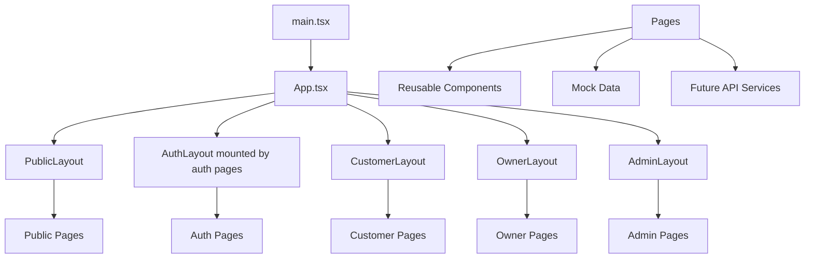

# Horizoné documentation

This folder is the complete system design set for the Horizoné hotel
booking platform. It documents the existing frontend and the backend it
needs. A new developer can understand the whole project from here, and a
backend developer can build the API from `10-api-contracts.md`.

## Project status

The frontend is a complete, clickable UI prototype (V0). It uses Vite +
React 19 + TypeScript + Tailwind v4 + shadcn/ui. All data is static mock
data. There is no backend yet. This documentation set prepares the project
for backend integration (V4) and production hardening (V5).

## Documentation index

| File | Purpose |
|---|---|
| `00-project-overview.md` | What Horizoné is, the stack, and a high-level architecture diagram |
| `01-requirements.md` | Functional and non-functional requirements pulled from the code |
| `02-product-scope.md` | What is in and out of scope today |
| `03-user-roles-and-permissions.md` | The four roles and a permissions matrix |
| `04-route-map.md` | Every actual route mapped to pages, layouts, and future APIs |
| `05-page-specifications.md` | What each page renders, its states, and its API needs |
| `06-frontend-architecture.md` | App entry, router, layouts, data layer, and target state |
| `07-folder-structure.md` | Current and recommended folder layout |
| `08-component-architecture.md` | Every reusable component, its status, and duplicates to fix |
| `09-data-models.md` | TypeScript entities plus Prisma models for the backend |
| `10-api-contracts.md` | Every REST endpoint with request and response payloads (backend-ready) |
| `11-authentication-flow.md` | Register, login, verify, reset, onboarding, tokens, and Mermaid flows |
| `12-booking-flow.md` | Search to result booking lifecycle across roles |
| `13-owner-dashboard-flow.md` | Owner onboarding to payouts |
| `14-admin-panel-flow.md` | Admin dashboard and hotel approval, moderation, offers |
| `15-state-management.md` | Current and recommended state, server state, and URL state |
| `16-error-loading-empty-states.md` | Loading, empty, error, not-found, and access-denied patterns |
| `17-ui-design-system.md` | Colors, type, spacing, radius, badges, and per-area styles |
| `18-versioning-and-modules.md` | V0 to V5 plan and the backend module architecture |
| `19-refactor-plan.md` | Safe step-by-step refactor with risks and a testing checklist |
| `20-backend-integration-plan.md` | Service layer, API client, tokens, TanStack Query, uploads, env vars |
| `21-testing-plan.md` | Unit, component, route, form, service, E2E, accessibility, and QA |
| `22-deployment-plan.md` | Build, preview, static hosting, env vars, SEO, performance, monitoring |

## Recommended reading order

If you are new to the project, read in this order:

1. `00-project-overview.md`
2. `02-product-scope.md`
3. `03-user-roles-and-permissions.md`
4. `04-route-map.md`
5. `06-frontend-architecture.md`
6. `07-folder-structure.md`

If you are building the backend, read:

1. `09-data-models.md`
2. `10-api-contracts.md`
3. `11-authentication-flow.md`
4. `12-booking-flow.md`
5. `13-owner-dashboard-flow.md`
6. `14-admin-panel-flow.md`
7. `18-versioning-and-modules.md`
8. `20-backend-integration-plan.md`

If you are refactoring the frontend, read:

1. `08-component-architecture.md`
2. `19-refactor-plan.md`
3. `07-folder-structure.md`
4. `15-state-management.md`
5. `20-backend-integration-plan.md`

If you are a designer, read:

1. `17-ui-design-system.md`
2. `05-page-specifications.md`
3. `16-error-loading-empty-states.md`

## Architecture at a glance

## Tech stack summary

- Vite + React 19 + TypeScript
- React Router v8
- Tailwind CSS v4 + shadcn/ui (base-vega style)
- lucide-react icons
- Recharts for dashboard charts
- Backend target: Node.js + Express + Prisma + PostgreSQL with JWT auth